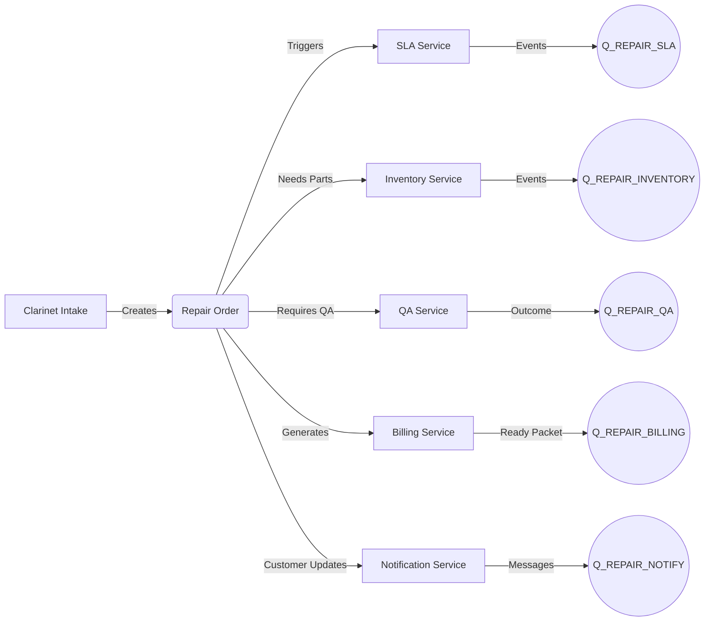

# Architecture Services Overview

The `repair_portal.core.services` package centralises cross-module orchestration.  Each service validates
payloads using the Pydantic contracts under `repair_portal.core.contracts` and emits events through
`repair_portal.core.events.publish`.

## Service Responsibilities

| Service | Responsibilities | Key Events |
| --- | --- | --- |
| `sla_service` | Start, pause, resume and tick SLA clocks. Updates `Repair Order` SLA fields and emits SLA topics. | `sla.started`, `sla.paused`, `sla.resumed` |
| `inventory_service` | Reserve, issue and return materials; mirrors data into `Repair Material Movement`. | `inventory.reserved`, `inventory.issued`, `inventory.returned` |
| `qa_service` | Persist QA outcomes and handle reopen logic. | `repair_order.qa_passed`, `repair_order.qa_failed` |
| `billing_service` | Assemble billing packets and mark invoices. | `billing.ready`, `billing.invoice_posted` |
| `warranty_service` | Record warranty adjustments and provide lookup APIs. | `warranty.adjusted` |
| `notify_service` | Deliver customer communications and portal toggles. | `customer.message_sent` |
| `tools_service` | Capture tool usage logs with calibration checks. | _n/a (logging only)_ |

## Event Topics

Event names are centralised in `repair_portal.core.registry.EventTopic`.  Use the enumeration instead of raw
strings when emitting or subscribing to events to prevent drift across modules.

## Queue Strategy

All asynchronous jobs use the queue names defined in `repair_portal.core.registry.QueueName`.  The
recommended mapping is:

- `Q_REPAIR_SLA` – SLA monitor tasks
- `Q_REPAIR_INVENTORY` – Stock entry reconciliation
- `Q_REPAIR_QA` – QA follow-ups and reopen tasks
- `Q_REPAIR_BILLING` – Billing packet preparation and invoice posting
- `Q_REPAIR_NOTIFY` – Email/SMS/portal notifications

## Security

Every whitelisted service entry point should combine `require_roles` and `rate_limited` decorators from
`repair_portal.core.security`.  The decorators rely on `frappe.get_roles` and Redis-backed rate limit buckets,
while falling back to no-ops when executed outside of a bench runtime (e.g., pure unit tests).

## Operational Notes

1. Run `python repair_portal/core/codebase_map.py` after modifying DocTypes, hooks, or whitelisted APIs.
2. Ensure `patches.txt` includes the latest `repair_portal.core.patches.*` entries so migrations remain
   deterministic across environments.
3. Monitor the new structured logs (`repair_portal.sla`, `repair_portal.inventory`, `repair_portal.billing`,
   `repair_portal.notify`, `repair_portal.warranty`, `repair_portal.tools`) for operational insight.
