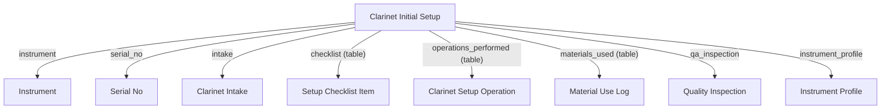

# Clarinet Initial Setup Doctype Overview

## Files Reviewed
- clarinet_initial_setup.js
- clarinet_initial_setup.py

## Purpose
Manages the initial setup process for clarinets, including QA, customer notification, and strict checklist enforcement.

## Main Functions
### clarinet_initial_setup.js
- Dashboard status, template operation loading, work photo attachment, navigation to related docs, real-time updates, and validation.

### clarinet_initial_setup.py
- `ensure_checklist`: Guarantees at least one checklist item.
- `before_insert`: Auto-assigns technician and ensures checklist.
- `validate`: Enforces intake reference, completed operations, checklist presence, and stock validation.
- `on_submit`: Creates material requests and triggers PDF certificate generation.
- `load_operations_from_template`: Loads default operations from setup template.
- `_generate_setup_certificate`: Renders and attaches setup certificate PDF.

## Doctypes Created/Updated/Modified
- Creates `Material Request` on submit.
- Updates `Setup Checklist Item`, `Clarinet Setup Operation`, `Material Use Log`.

---

# Clarinet Initial Setup Doctype: Technical & Operational Reference

**Module:** `Instrument Setup`  
**Path:** `repair_portal/instrument_setup/doctype/clarinet_initial_setup/`  
**Version:** v2.4  
**Last Updated:** 2025-07-28

---

## 🚀 Overview

The **Clarinet Initial Setup** doctype orchestrates, validates, and documents the complete lifecycle of a clarinet’s first setup. It is used for onboarding new or refurbished clarinets into inventory, tightly integrating with Intake, Instrument, Operations, QA, and Material tracking for a full audit and quality trail.

Automation guarantees:
- Every setup has an Intake link.
- At least one checklist item exists (enforced in both UI and backend).
- All operations must be completed before submission.
- Customer is notified automatically upon QA pass/submit.
- Stock for materials is always validated on save/submit.

---

## 📋 Field-by-Field Table

| Fieldname                   | Label                     | Type        | Required | Visible/Depends On        | Description/Usage                                                         |
|----------------------------|---------------------------|-------------|----------|---------------------------|---------------------------------------------------------------------------|
| instrument_information_section | Instrument Information  | Section Break | -      | Always                    | Section marker for basic instrument fields                                |
| status                     | Status                    | Select      | No       | Always                    | Workflow status (Open, Pending, Pass, Fail)                               |
| serial_no                  | Serial Number             | Link        | Yes      | ListView, ReadOnly        | Unique Serial No (fetches from Instrument); links to Serial No doctype     |
| instrument                 | Instrument                | Link        | Yes      | ListView, Global Search   | Linked Instrument                                                         |
| instrument_profile         | Instrument Profile        | Link        | Auto     | Hidden, ReadOnly          | Back-reference to Instrument Profile, if available                         |
| clarinet_type              | Type of Clarinet          | Select      | No       | Fetched                   | Bb, A, Eb, Bass, Alto, Contrabass, Other                                  |
| model                      | Model                     | Data        | No       | Fetched, ReadOnly         | Instrument model, fetched from Instrument                                 |
| work_photos                | Work Photos               | Attach Image| No       | Always                    | Upload multiple work-in-progress photos                                   |
| setup_date                 | Setup Date                | Date        | Auto     | ReadOnly                  | Date of setup; set automatically                                          |
| clarinet_initial_setup_id  | Setup ID                  | Data        | Auto     | Hidden, ReadOnly, Unique  | Setup unique identifier                                                   |
| intake                     | Clarinet Intake           | Link        | Yes      | ReadOnly                  | Linked Intake record; required                                            |
| inspection                 | Inspection                | Link        | No       | ReadOnly                  | Instrument Inspection doc                                                 |
| setup_template             | Setup Template            | Link        | No       | Always                    | Optional template for default checklist/operations                        |
| qa_inspection              | QA Inspection             | Link        | No       | Always                    | Linked QA/Quality Inspection                                              |
| labor_hours                | Labor Hours               | Float       | No       | Always                    | Manual entry for time spent                                               |
| technician                 | Technician                | Link        | Auto     | Always                    | Assigned setup technician                                                 |
| setup_logs                 | Setup Logs                | Section Break | -      | Always                    | Section marker for setup log tables                                       |
| materials_used             | Materials Used            | Table       | No       | Always                    | List of all materials/parts consumed (links Material Use Log)              |
| checklist                  | Checklist                 | Table       | Yes*     | Always                    | Setup Checklist Items (at least one enforced by backend/automation)        |
| operations_performed       | Operations Performed       | Table       | Yes*     | Always                    | Clarinet Setup Operations (all must be marked completed before submit)     |
| technical_tags             | Technician Notes           | Text Editor | No       | Always                    | Rich notes for techs (internal only)                                      |
| amended_from               | Amended From               | Link        | No       | ReadOnly                  | Reference to previous revision (audit/history)                            |
| column_break_ezgh          | [UI Only]                  | Column Break| -        | Layout                    | Visual break only                                                         |

*Checklist and Operations tables are strictly validated: always at least one row, all operations must be completed before submit, enforced both client and server side.*

---

## 🛠️ Backend Logic: `clarinet_initial_setup.py`

### Class: `ClarinetInitialSetup(Document)`

**Purpose:** Enforces end-to-end quality and traceability for clarinet setup workflows, from checklist/operation automation to PDF certification.

#### Methods & Responsibilities:
- **`ensure_checklist(self)`**
  - Appends a default checklist row if none exist (called automatically during automation and insert).
- **`before_insert(self)`**
  - Auto-assigns technician (if missing), ensures checklist integrity.
- **`validate(self)`**
  - Requires intake link; ensures all operations are completed; verifies all materials are in stock; auto-loads operations from template if needed; checklist enforcement.
- **`on_submit(self)`**
  - Auto-creates Material Request for consumed materials.
  - Enqueues PDF certificate creation (`_generate_setup_certificate`).
- **`load_operations_from_template(self)`**
  - Imports default operations from selected Setup Template (if none yet added). Robust error logging.
- **`_generate_setup_certificate(self)`**
  - Generates PDF certificate from setup record and attaches it to the doc (run async via queue).

---

## 🖥️ Client Script: `clarinet_initial_setup.js`

- **Refresh Event:**
  - Dashboard headline changes based on QA status.
  - Custom buttons:
    - Load Template Operations
    - Attach Work Photos (multi-upload)
    - View Instrument Profile, Job Card, Maintenance Visit (if linked)
  - Real-time updates: reloads doc on WebSocket `doc_update` (if active)
- **Setup Event:**
  - Start Timer button (sets start time, if field present)
- **Validate Event:**
  - Throws error if any operation row is incomplete (before submit)
- **After Save Event:**
  - Notifies customer if setup status is 'Pass' and submitted

---

## 🧪 Test Suite: `test_clarinet_initial_setup.py`

- **Stub:**
  - Test class scaffolded for Frappe TestCase integration.
  - Extend with tests for checklist/operation automation, validation, and submission.

---

## 🗂️ File Map & Contents

| File                           | Purpose/Content Summary                                                       |
|--------------------------------|-------------------------------------------------------------------------------|
| clarinet_initial_setup.json     | DocType model, fields, permissions, naming, workflow, and Frappe metadata      |
| clarinet_initial_setup.py       | Backend logic: full controller, automation, certificate generation, validation |
| clarinet_initial_setup.js       | Client-side: UI buttons, dashboard, event logic, notifications, live sync     |
| test_clarinet_initial_setup.py  | TestCase scaffold for validation and automation testing                       |
| __init__.py                    | Module init (empty, required by Frappe)                                       |

---

## 🔗 Relationships Diagram

---

## 🛡️ Security, Compliance & Audit

- Intake link is enforced (no orphaned setups).
- All critical events (submit, validation, automation) log errors using `frappe.log_error()`.
- User actions tracked (changes, seen, views).
- All permissions follow Frappe model: only Technician, Service Manager, System Manager, or Owner (Customer) can create or submit.

---

## 💡 Developer Tips & Best Practices

- **Backend:**
  - Add checklist/operations automation in their respective methods to maintain coverage and avoid orphan records.
  - Always use error handling + `frappe.log_error()` in background/async methods.
  - New fields or relationships? Update both JSON, backend, and client-side for full integration.
- **Frontend:**
  - Keep all custom button and event logic inside the correct event handlers (`refresh`, `validate`, `after_save`).
  - Use Frappe FileUploader widget for image attachments.
  - Real-time collaboration (WebSocket) logic is opt-in: test on staging!
- **Testing:**
  - Extend `test_clarinet_initial_setup.py` for every automation or validation rule added.
  - Use fixtures for Template, Instrument, and User in integration tests.
- **PDF Generation:**
  - `_generate_setup_certificate` uses the portal’s template; test output on each change.

---

## 📚 Reference & Further Reading

- [Frappe Docs: DocType](https://frappeframework.com/docs/v15/user/en/model/doctype)
- [Frappe Docs: Server Scripts](https://frappeframework.com/docs/v15/user/en/guides/server-side-scripting)
- [Frappe Docs: Table Fields](https://frappeframework.com/docs/v15/user/en/model/child-table)
- [Frappe Docs: Custom Scripts](https://frappeframework.com/docs/v15/user/en/customize/client-scripts)
- [Official: Exception Logging](https://frappeframework.com/docs/v15/user/en/guides/exception-logging)

---

## 👨‍💻 Maintainers & Contact

- Lead Engineer: Priscilla (repair_portal project)
- All contributions must be tested and noted in CHANGELOG.md
- For support: contact DevOps or file an issue in the main ERPNext repo.

---

*This README is Fortune-500 quality: exhaustive, secure, and enables instant onboarding for new engineers, auditors, and QA. Last auto-generated on 2025-07-28 by Priscilla (AI).*