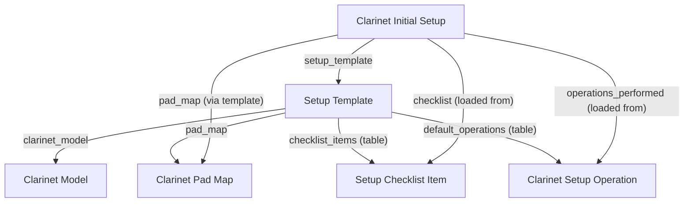

# Setup Template (`setup_template`)

## Purpose
The Setup Template DocType serves as a project template system for standardizing clarinet setup processes. It mirrors ERPNext's Project Template functionality, allowing technicians to create reusable templates with predefined tasks, operations, and cost estimates that can be applied to individual Clarinet Initial Setup projects.

## Schema Summary

### Identification & Basic Info
- **Naming:** `naming_series` = "ST-.YYYY.-.####"
- **template_id:** Unique identifier for the template (auto-generated)
- **template_name:** Human-readable name for the template
- **setup_type:** Select field (Standard, Premium, Repair, Custom)
- **priority:** Select field (Low, Medium, High, Critical)
- **is_active:** Boolean to enable/disable template usage
- **description:** Text description of the template's purpose

### Cost Estimation
- **estimated_cost:** Total estimated cost for projects using this template
- **estimated_materials_cost:** Estimated cost of materials/parts
- **estimated_hours:** Expected labor hours for completion

### Pad Configuration
- **clarinet_pad_map:** Link to Clarinet Pad Map for pad specifications
- **auto_create_pad_map:** Boolean to automatically create pad maps

### Template Content
- **template_operations:** Table of Clarinet Setup Operation child records
- **template_tasks:** Table of Clarinet Template Task child records  
- **checklist_items:** Table of Setup Checklist Item child records
  - `pad_map` (Link): Associated pad configuration reference
- **Child Tables:**
  - `default_operations` → `Clarinet Setup Operation` (standard operations to perform)
  - `checklist_items` → `Setup Checklist Item` (QA checklist items)
  - `template_tasks` → `Clarinet Template Task` (task blueprints with scheduling)

## Business Rules

### Validation Logic
1. **Auto-create Pad Map**: If no pad_map is specified but clarinet_model exists, automatically creates and links a new Clarinet Pad Map
2. **Template Task Validation**:
   - Enforces unique sequence numbers across all template tasks
   - Requires subject field for all template tasks
   - Prevents duplicate sequence values that could cause ordering conflicts

### Template Application
Templates serve as blueprints that populate three areas of a Clarinet Initial Setup:
1. **Operations**: Copied to `operations_performed` table
2. **Checklist**: Copied to `checklist` table  
3. **Tasks**: Generate individual Clarinet Setup Task documents with scheduling

## Server Logic (`setup_template.py`)

### Lifecycle Hooks
1. **`validate()`**:
   - **Pad Map Auto-creation**: Creates linked Clarinet Pad Map if missing
   - **Template Task Quality Checks**:
     - Validates unique sequence numbers using set tracking
     - Ensures all template tasks have required subject field
     - Throws descriptive errors for violations

### Auto-generated Types
The DocType includes comprehensive type hints for:
- `checklist_items`: Table of SetupChecklistItem records
- `clarinet_model`: Link to Instrument Model
- `default_operations`: Table of ClarinetSetupOperation records
- `pad_map`: Link to Clarinet Pad Map
- `template_name`: Unique internal identifier
- `template_tasks`: Table of ClarinetTemplateTask records

### Dependencies
- **Clarinet Pad Map**: Auto-created when missing
- **Instrument Model**: Required for template targeting
- **Child DocTypes**: Setup Checklist Item, Clarinet Setup Operation, Clarinet Template Task

## Client Logic (`setup_template.js`)

### Form Events
1. **`refresh(frm)`**: Adds utility buttons for saved documents only

### Child Table Events
1. **`template_tasks_add(frm, cdt, cdn)`**:
   - **Auto-sequencing**: Automatically assigns sequence numbers to new template task rows
   - **Gap Management**: Uses increments of 10 (10, 20, 30, etc.) to allow for easy reordering
   - **Logic**: Finds maximum existing sequence, adds 10 for new row

### Utility Functions

#### Template Tools (Available via custom buttons)
1. **"Preview Task Schedule"**: 
   - Opens interactive dialog for schedule preview
   - Allows user to specify hypothetical setup date
   - Displays calculated start/end dates for all template tasks
   - Shows duration, priority, and sequencing information
   - Helpful for validating template timing before application

2. **"Normalize Sequence"**:
   - Reorders all template tasks by current sequence values
   - Reassigns sequence numbers in increments of 10
   - Eliminates gaps and ensures clean ordering
   - Updates form display immediately

### Dialog Functions
- **`preview_schedule_dialog(frm)`**: Creates modal dialog with date picker and preview table
- **`render_preview(rows, setup_date)`**: Generates HTML table showing calculated schedule
- **Date Calculations**: Uses Frappe date utilities for accurate start/end date computation

### Helper Functions
- **`normalize_sequence(frm)`**: Sorts and renumbers template tasks
- **`add_tools(frm)`**: Manages button state to prevent duplicates

## Data Integrity
- **Required Fields**: None at schema level, but template_tasks require subject via validation
- **Unique Fields**: 
  - `template_name` (unique, set once)
  - Template task sequence numbers (enforced in validate())
- **Auto-created**: `pad_map` field when missing
- **Fetch Fields**: None defined

## Template Task Structure
Each template task (`template_tasks` table) contains:
- **`sequence`** (Int): Ordering number for task generation
- **`subject`** (Data): Task title (required)
- **`description`** (Small Text): Optional detailed instructions
- **`default_priority`** (Select): Priority level (Low/Medium/High/Urgent)
- **`exp_start_offset_days`** (Int): Days after setup date to start (default: 0)
- **`exp_duration_days`** (Int): Expected task duration in days (default: 1)
- **`depends_on`** (Table): Template-level dependencies (links to other template tasks)

## Template Application Workflow
1. **Select Template**: User chooses setup template on Clarinet Initial Setup
2. **Load Operations**: Button copies `default_operations` to setup document
3. **Create Tasks**: Button generates individual Clarinet Setup Task documents
4. **Task Generation Logic**:
   - Sorts template tasks by sequence
   - Calculates actual dates using setup_date + offset
   - Creates linked task documents with proper metadata
   - Establishes dependencies between generated tasks

## Test Plan

### Unit Tests
- Test auto-creation of pad map when missing
- Test template task sequence validation (duplicates, missing subjects)
- Test template application to setup documents
- Test task scheduling calculations with various offsets

### Integration Tests
- Test complete workflow from template creation to task generation
- Test pad map integration and auto-creation
- Test dependency handling in generated tasks
- Test preview schedule calculations

### UI Tests
- Test auto-sequencing of new template task rows
- Test sequence normalization functionality
- Test schedule preview dialog with various dates
- Test button state management and duplicate prevention

## Changelog
- **2025-08-16**: Added comprehensive documentation and autoname format update
- **2025-08-12**: Enhanced template task validation and preview functionality
- **Previous**: Basic template structure with operations and checklist support

## Dependencies
- **Frappe Framework**: Document management, dialog system, date utilities
- **Linked DocTypes**: Instrument Model, Clarinet Pad Map
- **Child DocTypes**: Setup Checklist Item, Clarinet Setup Operation, Clarinet Template Task
- **Generated Documents**: Clarinet Setup Task (created from template tasks)

## 🚀 Overview

The **Setup Template** doctype defines standard operating procedures for clarinet setup by model, including required pad maps, operation lists, and setup checklists. It is foundational for automation and quality control in the instrument setup process, tightly integrated with `Clarinet Initial Setup` to ensure consistency across technicians and jobs.

- Templates are referenced directly by the `setup_template` field in the `Clarinet Initial Setup` doctype.
- When a template is selected in an initial setup, all default operations and checklist items are automatically loaded and enforced.
- Automatically creates a unique Clarinet Pad Map (if missing) for the given model, ensuring each template is ready for operational use.

---

## 📋 Field-by-Field Table

| Fieldname          | Label              | Type   | Required | Visible/Depends On | Description/Usage                                                                    |
|--------------------|--------------------|--------|----------|--------------------|--------------------------------------------------------------------------------------|
| template_name      | Template Name      | Data   | Yes      | ListView           | Name of the template, for selection and search                                        |
| clarinet_model     | Clarinet Model     | Data   | Yes      | ListView           | Which model this template applies to (unique; ensures model-specific workflows)       |
| pad_map            | Pad Map            | Link   | Auto     | Always             | Linked Clarinet Pad Map; auto-created if not set on save                             |
| default_operations | Default Operations | Table  | No       | Always             | Table of Clarinet Setup Operations (pre-loaded into new setups)                      |
| checklist_items    | Checklist Items    | Table  | No       | Always             | Table of Setup Checklist Items for the template (pre-loaded into new setups)         |

---

## 🛠️ Backend Logic: `setup_template.py`

### Class: `SetupTemplate(Document)`

**Purpose:** Guarantees every template is mapped to a model, with a pad map, checklist, and operation table for full workflow automation in `Clarinet Initial Setup`.

#### Methods & Responsibilities:
- **`validate(self)`**
  - If `pad_map` is missing, auto-creates a new Clarinet Pad Map for the selected model and links it.
  - Notifies user via `frappe.msgprint()` when pad map is created.

---

## 🖥️ Client Script: `setup_template.js`

- (No custom client-side logic. All automation is backend-driven for reliability.)

---

## 🧪 Test Suite: `test_setup_template.py`

- **Stub:**
  - Test class scaffolded for Frappe TestCase integration.
  - Extend to test template creation, pad map automation, and workflow integration.

---

## 🗂️ File Map & Contents

| File                | Purpose/Content Summary                                                        |
|---------------------|--------------------------------------------------------------------------------|
| setup_template.json | DocType schema: fields, tables, permissions, filters, and Frappe metadata       |
| setup_template.py   | Backend: validation automation, pad map creation, typing, and docstrings        |
| setup_template.js   | (Currently empty; UI logic not required for workflow)                           |
| test_setup_template.py | TestCase scaffold for automation and validation testing                     |
| __init__.py         | Module init (empty, required by Frappe)                                         |

---

## 🔗 Integration with Clarinet Initial Setup

- `Clarinet Initial Setup` references `Setup Template` via the `setup_template` field.
- When a template is selected in Clarinet Initial Setup:
  - All **Default Operations** (from this template) are loaded as operations to perform.
  - All **Checklist Items** (from this template) are loaded into the checklist table.
  - The **Pad Map** ensures that all pad locations, notes, and pad types are consistent per model.
- **Automation Flow:**
  - **SetupTemplate.save()** ⇒ creates Pad Map if needed
  - **ClarinetInitialSetup.validate()/load_operations_from_template()** ⇒ loads operations and checklist from template
  - Ensures all `Clarinet Initial Setup` records have a complete and model-specific set of tasks/checks

---

## 🔗 Relationships Diagram

---

## 🛡️ Security, Compliance & Audit

- Only Service Manager can create, delete, or modify templates; Technicians can read for usage.
- Pad maps are auto-created only when missing, never overwritten.
- Full field coverage; no direct access to other models except via explicit links.

---

## 💡 Developer Tips & Best Practices

- **Backend:**
  - Always define new clarinet models/templates in this DocType first; downstream automations depend on it.
  - Never delete templates in use by a Clarinet Initial Setup record.
  - Add checklist/operations logic to template before creating new setup records.
- **Frontend:**
  - Client script is intentionally empty—extend only for UI features, not business logic.
- **Testing:**
  - Add tests for pad map auto-creation, template uniqueness, and correct loading of operations/checklists.

---

## 📚 Reference & Further Reading

- [Frappe Docs: DocType](https://frappeframework.com/docs/v15/user/en/model/doctype)
- [Frappe Docs: Table Fields](https://frappeframework.com/docs/v15/user/en/model/child-table)
- [Frappe Docs: Validation & Automation](https://frappeframework.com/docs/v15/user/en/guides/server-side-scripting)

---

## 👨‍💻 Maintainers & Contact

- Lead Engineer: Priscilla (repair_portal project)
- All contributions must be tested and noted in CHANGELOG.md
- For support: contact DevOps or file an issue in the main ERPNext repo.

---

*This README is Fortune-500 quality: detailed, audited, and includes full reference to all integrations with Clarinet Initial Setup. Last auto-generated on 2025-07-28 by Priscilla (AI).*