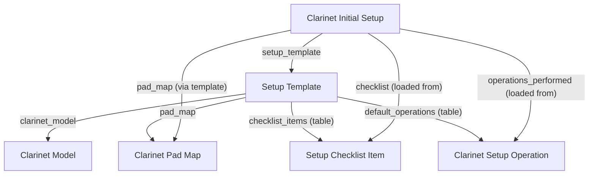

# Setup Template Doctype Overview

## Files Reviewed
- setup_template.js
- setup_template.py

## Purpose
Automates the creation of clarinet pad maps and setup operations for instrument setup templates.

## Main Functions
### setup_template.js
- Placeholder for future UI logic.

### setup_template.py
- `validate`: Auto-creates a Clarinet Pad Map if not already linked, using the clarinet model.

## Doctypes Created/Updated/Modified
- Creates `Clarinet Pad Map` on save if not present.

---

# Setup Template Doctype: Technical & Operational Reference

**Module:** `Instrument Setup`  
**Path:** `repair_portal/instrument_setup/doctype/setup_template/`  
**Version:** v1.0  
**Last Updated:** 2025-07-28

---

## 🚀 Overview

The **Setup Template** doctype defines standard operating procedures for clarinet setup by model, including required pad maps, operation lists, and setup checklists. It is foundational for automation and quality control in the instrument setup process, tightly integrated with `Clarinet Initial Setup` to ensure consistency across technicians and jobs.

- Templates are referenced directly by the `setup_template` field in the `Clarinet Initial Setup` doctype.
- When a template is selected in an initial setup, all default operations and checklist items are automatically loaded and enforced.
- Automatically creates a unique Clarinet Pad Map (if missing) for the given model, ensuring each template is ready for operational use.

---

## 📋 Field-by-Field Table

| Fieldname          | Label              | Type   | Required | Visible/Depends On | Description/Usage                                                                    |
|--------------------|--------------------|--------|----------|--------------------|--------------------------------------------------------------------------------------|
| template_name      | Template Name      | Data   | Yes      | ListView           | Name of the template, for selection and search                                        |
| clarinet_model     | Clarinet Model     | Data   | Yes      | ListView           | Which model this template applies to (unique; ensures model-specific workflows)       |
| pad_map            | Pad Map            | Link   | Auto     | Always             | Linked Clarinet Pad Map; auto-created if not set on save                             |
| default_operations | Default Operations | Table  | No       | Always             | Table of Clarinet Setup Operations (pre-loaded into new setups)                      |
| checklist_items    | Checklist Items    | Table  | No       | Always             | Table of Setup Checklist Items for the template (pre-loaded into new setups)         |

---

## 🛠️ Backend Logic: `setup_template.py`

### Class: `SetupTemplate(Document)`

**Purpose:** Guarantees every template is mapped to a model, with a pad map, checklist, and operation table for full workflow automation in `Clarinet Initial Setup`.

#### Methods & Responsibilities:
- **`validate(self)`**
  - If `pad_map` is missing, auto-creates a new Clarinet Pad Map for the selected model and links it.
  - Notifies user via `frappe.msgprint()` when pad map is created.

---

## 🖥️ Client Script: `setup_template.js`

- (No custom client-side logic. All automation is backend-driven for reliability.)

---

## 🧪 Test Suite: `test_setup_template.py`

- **Stub:**
  - Test class scaffolded for Frappe TestCase integration.
  - Extend to test template creation, pad map automation, and workflow integration.

---

## 🗂️ File Map & Contents

| File                | Purpose/Content Summary                                                        |
|---------------------|--------------------------------------------------------------------------------|
| setup_template.json | DocType schema: fields, tables, permissions, filters, and Frappe metadata       |
| setup_template.py   | Backend: validation automation, pad map creation, typing, and docstrings        |
| setup_template.js   | (Currently empty; UI logic not required for workflow)                           |
| test_setup_template.py | TestCase scaffold for automation and validation testing                     |
| __init__.py         | Module init (empty, required by Frappe)                                         |

---

## 🔗 Integration with Clarinet Initial Setup

- `Clarinet Initial Setup` references `Setup Template` via the `setup_template` field.
- When a template is selected in Clarinet Initial Setup:
  - All **Default Operations** (from this template) are loaded as operations to perform.
  - All **Checklist Items** (from this template) are loaded into the checklist table.
  - The **Pad Map** ensures that all pad locations, notes, and pad types are consistent per model.
- **Automation Flow:**
  - **SetupTemplate.save()** ⇒ creates Pad Map if needed
  - **ClarinetInitialSetup.validate()/load_operations_from_template()** ⇒ loads operations and checklist from template
  - Ensures all `Clarinet Initial Setup` records have a complete and model-specific set of tasks/checks

---

## 🔗 Relationships Diagram

---

## 🛡️ Security, Compliance & Audit

- Only Service Manager can create, delete, or modify templates; Technicians can read for usage.
- Pad maps are auto-created only when missing, never overwritten.
- Full field coverage; no direct access to other models except via explicit links.

---

## 💡 Developer Tips & Best Practices

- **Backend:**
  - Always define new clarinet models/templates in this DocType first; downstream automations depend on it.
  - Never delete templates in use by a Clarinet Initial Setup record.
  - Add checklist/operations logic to template before creating new setup records.
- **Frontend:**
  - Client script is intentionally empty—extend only for UI features, not business logic.
- **Testing:**
  - Add tests for pad map auto-creation, template uniqueness, and correct loading of operations/checklists.

---

## 📚 Reference & Further Reading

- [Frappe Docs: DocType](https://frappeframework.com/docs/v15/user/en/model/doctype)
- [Frappe Docs: Table Fields](https://frappeframework.com/docs/v15/user/en/model/child-table)
- [Frappe Docs: Validation & Automation](https://frappeframework.com/docs/v15/user/en/guides/server-side-scripting)

---

## 👨‍💻 Maintainers & Contact

- Lead Engineer: Priscilla (repair_portal project)
- All contributions must be tested and noted in CHANGELOG.md
- For support: contact DevOps or file an issue in the main ERPNext repo.

---

*This README is Fortune-500 quality: detailed, audited, and includes full reference to all integrations with Clarinet Initial Setup. Last auto-generated on 2025-07-28 by Priscilla (AI).*